# Windows Server 2022 Network Services Lab (GNS3)

A Windows Server 2022 VM set up as the gateway between an internal and an external network in GNS3, running four services: **NAT/PAT, NTP, FTP and OpenSSH**. Each service is configured, tested from a client, and verified with packet captures.

Individual project for the Enterprise Networking module, Diploma in Cybersecurity & Digital Forensics, Temasek Polytechnic (May 2024).

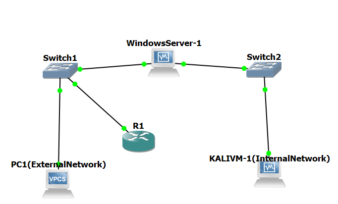

## What I built

| Service | What it does in this lab | How I verified it |
|---|---|---|
| NAT / PAT | Translates internal hosts (10.15.0.0/16) to a public pool (1.1.15.1 to 1.1.15.14) | RRAS mapping table and Wireshark capture |
| NTP | Server syncs from `time.windows.com` and serves time to a Cisco router | `w32tm /query`, `show ntp status` on the router |
| FTP | IIS FTP site with a dedicated user and read/write permissions | Login and file listing from Kali |
| OpenSSH | SSH server on Windows with a dedicated user | Login from Kali and Wireshark capture of the key exchange |

## Environment

- GNS3 with the GNS3 VM, VirtualBox for the Windows Server 2022 and Kali VMs
- Cisco IOS router (R1), two Ethernet switches, one VPCS host
- Wireshark for traffic verification

## Addressing

| Device | Interface | Address | Role |
|---|---|---|---|
| WindowsServer-1 | Adapter 1 | 10.15.0.2/16 | Internal gateway |
| WindowsServer-1 | Adapter 2 | 25.0.0.2/22 | External side |
| WindowsServer-1 | Adapter 3 | DHCP (bridged) | Internet access for NTP and package installs |
| KALIVM-1 | eth0 | 10.15.0.3/16 | Internal client |
| PC1 (VPCS) | e0 | 25.0.0.3/22 | External host |
| R1 | Fa0/0 | 25.0.0.10/22 | NTP client |
| NAT pool | | 1.1.15.1 to 1.1.15.14 (/28) | Public addresses |

The server VM has three adapters. Two use the GNS3 generic driver (UDP tunnels) and one is bridged to the host.

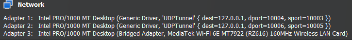

## 1. NAT / PAT

1. Installed the **Remote Access** role with the **Routing** role service.
2. Ran the Routing and Remote Access wizard and chose **Network address translation (NAT)**.
3. Marked the 25.0.0.2 interface as the public interface with NAT enabled, and the 10.15.0.2 interface as private.
4. Added the public address pool 1.1.15.1 to 1.1.15.14.
5. Added a default route out of the external interface.

| Public interface | Address pool |
|---|---|
| 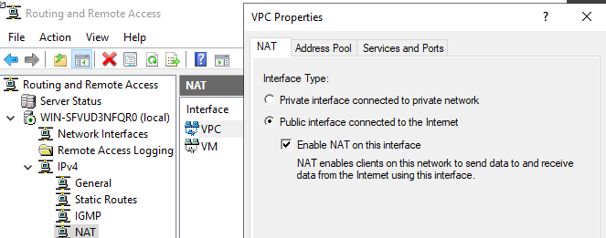 | 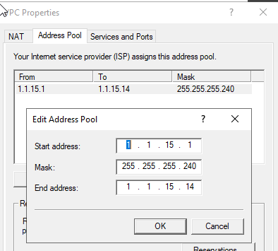 |

**Result:** Kali (10.15.0.3) pings the external host, and both the RRAS mapping table and the capture on the external link show the source rewritten to 1.1.15.1.

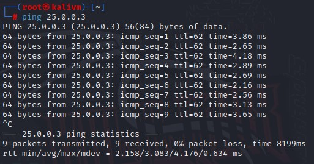
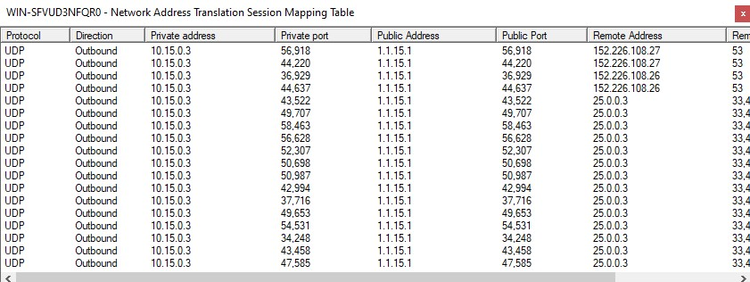
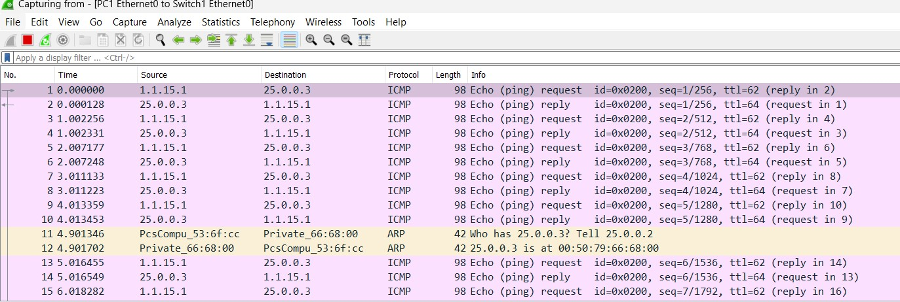

## 2. NTP

The server syncs from `time.windows.com` and is flagged as a reliable source so other devices can sync from it. UDP 123 is allowed inbound.

```powershell
w32tm /config /manualpeerlist:"time.windows.com" /syncfromflags:manual /reliable:YES /update
Restart-Service w32time
w32tm /resync
```

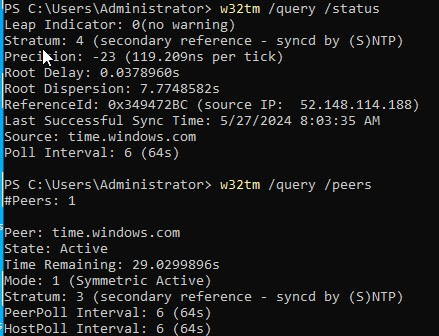

R1 then uses the server as its time source:

```
R1(config)# ntp server 25.0.0.2
```

**Result:** `show ntp status` reports the clock as synchronized with reference 25.0.0.2, and `show clock detail` shows the time source as NTP.

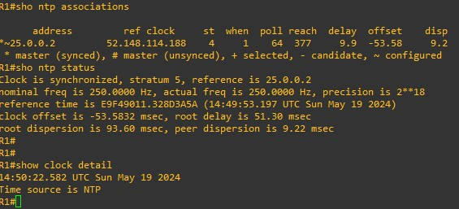

## 3. FTP

1. Installed **Web Server (IIS)** with **FTP Server** and **FTP Service**.
2. Created an FTP site bound to 10.15.0.2 on port 21.
3. Enabled Basic authentication and authorised a single named user with read and write.
4. Gave that user NTFS permissions on the FTP root and allowed TCP 21 inbound.

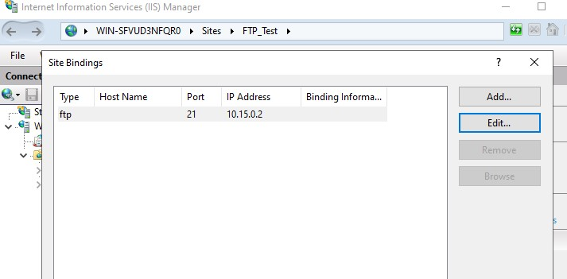
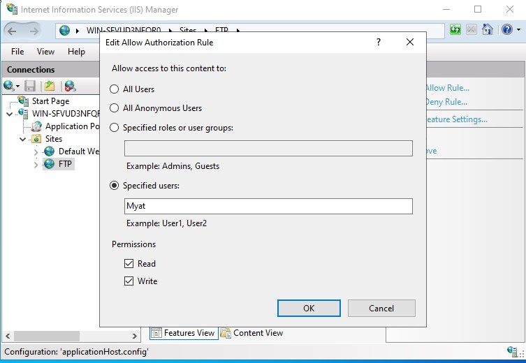

**Result:** login and directory listing from Kali.

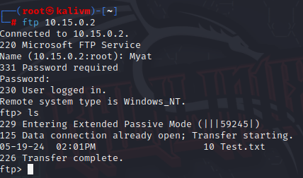

## 4. OpenSSH

```powershell
Add-WindowsCapability -Online -Name OpenSSH.Server~~~~0.0.1.0
Start-Service sshd
Set-Service -Name sshd -StartupType 'Automatic'
```

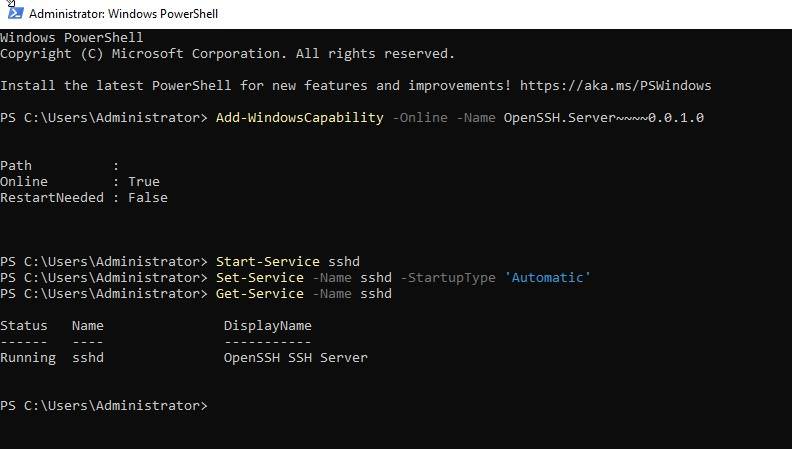

**Result:** SSH login from Kali lands in a Windows shell, and the capture shows the SSHv2 key exchange followed by encrypted packets.

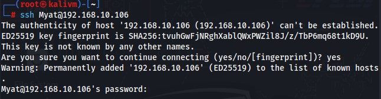
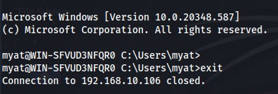
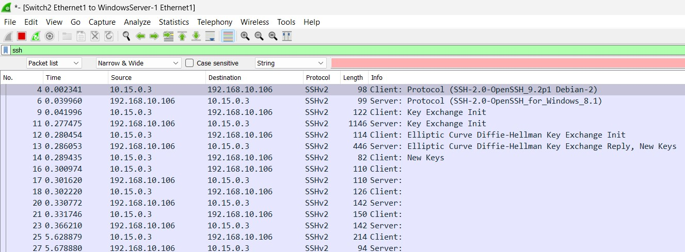

## What I would improve

- **FTP is unencrypted here.** The site uses Basic authentication with no SSL, so credentials cross the wire in clear text. In production I would require FTPS or replace it with SFTP over the OpenSSH server that is already running.
- **SSH uses passwords.** Key based authentication with password login disabled would be stronger.
- **Service accounts** were set to never expire for the lab. Real accounts should follow a password policy.
- **NTP** has a single upstream source. Two or more upstream servers would give resilience.

## Files

- [`configs/windows-server.ps1`](configs/windows-server.ps1): PowerShell and command line steps for the server
- [`configs/R1.ios`](configs/R1.ios): router configuration and verification commands
- [`configs/kali-interfaces`](configs/kali-interfaces): static addressing on the Kali client
